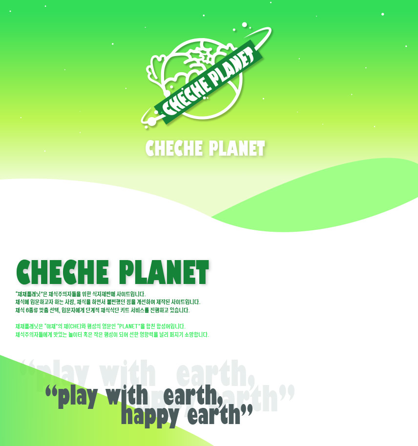
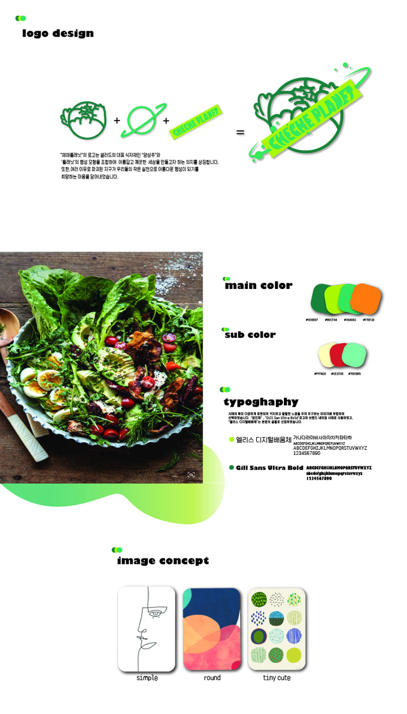
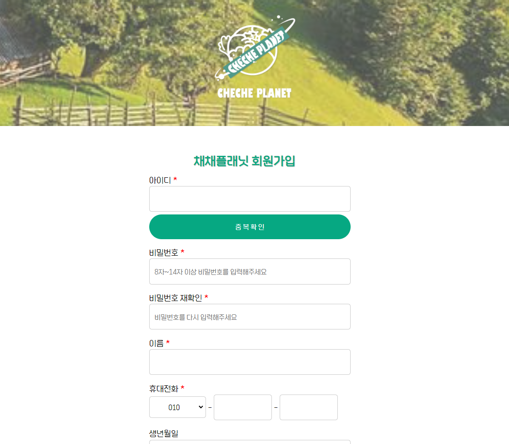

# 채채플래닛(CHECHE PLANET)

Property: 개인 프로젝트
깃 허브 주소: https://github.com/nniikkee/checheplanet
날짜: January 17, 2022 → January 26, 2022
상태: 진행중
상태 - 서브: 서브-코딩
상태 -메인: 메인- 코딩

# 채채플래닛

1. 디자인 100%, 코딩 100%
2. 디자인 : FIGMA, PHOTOSHOP
3. 사용언어 : HTML, CSS, JQUERY, JAVASCRIPT

## 1. 웹페이지 기획서

## 2. 페이지 구성 디자인

[https://www.figma.com/embed?embed_host=notion&url=https%3A%2F%2Fwww.figma.com%2Ffile%2F9FtUP4369mC83gEWlxgonw%2F%25EC%25B1%2584%25EC%25B1%2584%25ED%2594%258C%25EB%259E%2598%25EB%258B%259B%3Fnode-id%3D0%253A1](https://www.figma.com/embed?embed_host=notion&url=https%3A%2F%2Fwww.figma.com%2Ffile%2F9FtUP4369mC83gEWlxgonw%2F%25EC%25B1%2584%25EC%25B1%2584%25ED%2594%258C%25EB%259E%2598%25EB%258B%259B%3Fnode-id%3D0%253A1)

회원가입 페이지

로그인 모달창

## 3. 페이지 상세 설명

로그인, 회원가입 페이지는 이미 만들어져 있어서 그대로 사용할 예정

### 1.**메인페이지 : 디자인 4일 + 코딩 6일**

목표 : 내가 직접 한 디자인을 코드로 작성해 구현을 목표로 한다.

---

- HTML, CSS에 대한 이해도를 높이고, 웹페이지 구현에 있어 효율적으로 구현 할 수있도록 노력하였다.
- 베스트 상품 섹션의 동적 요소는 ‘[오픈소스(AOS)](https://github.com/michalsnik/aos.git)’를 사용하였다.
- [지구를 위한 작은 행동]의 슬라이더는 ‘자바스크립트’를 이용하여 자동으로 움직이게 구현하였다.

### 2.서브페이지 : 디**자인 2일 + 코딩 3일**

목표 : 최소한의 이미지, 상세페이지는 코딩으로 구현한다.

---

- 자바스크립트를 이용해 최상단 옵션의 작은 이미지를 클릭했을 때, 큰 화면의 이미지에 나타나도록 구현하였다.
- 리뷰 섹션에 클릭했을때 리뷰를 자세히 볼 수 있도록 제이쿼리를 이용하여 구현하였다.
클릭을 하면 리뷰의 가려진 부분을 볼 수 있게 하였다.
- 상세페이지를 마크업을 통해 구현하도록 노력하였다.

## 4. 진행 과정 기록

[서브](https://www.notion.so/264ab3d0335946858616029d5b723cd7)

[메인](https://www.notion.so/9327f3ed7841472fa11c60a46d7c5959)

[1/24 - 서브) 디자인 완료](https://www.notion.so/1-24-7e20b91c47f546c1a703db42aad99c2b)

[1/24 - 메인) 애니메이션효과](https://www.notion.so/1-24-ab9a1b08822246e8b92894a01d2878a1)

[1/25 - 서브페이지 Top option section 코딩](https://www.notion.so/1-25-Top-option-section-f931fbc9bc5841209a393bc0da01f9e3)