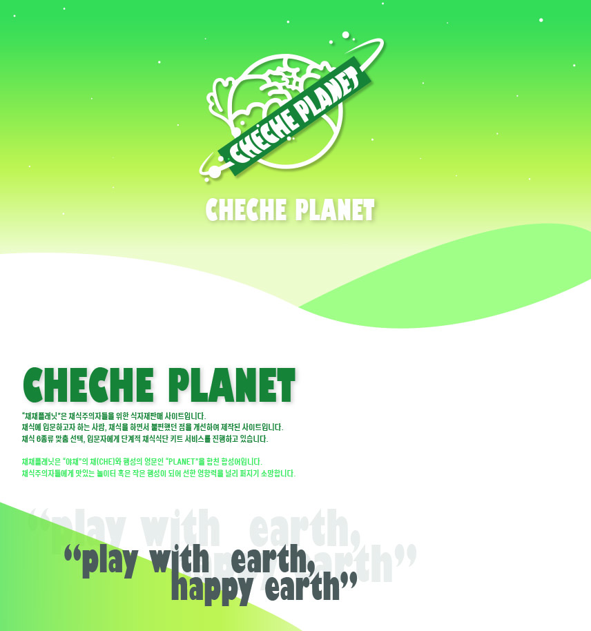
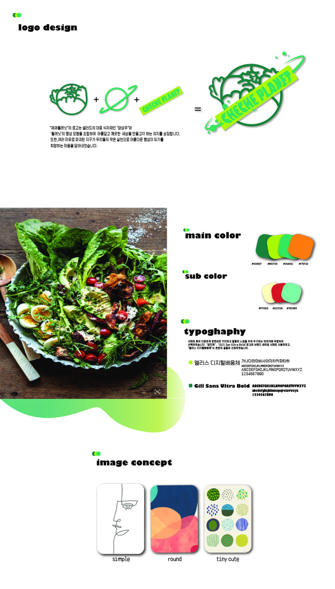
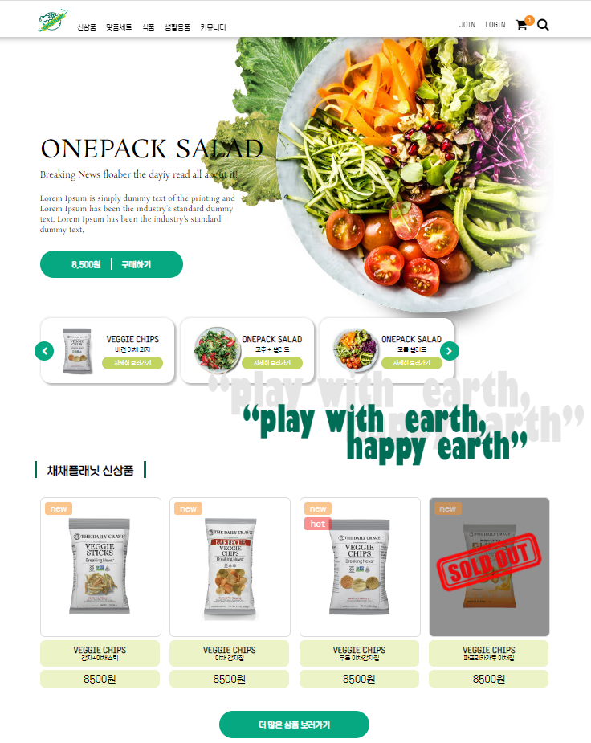
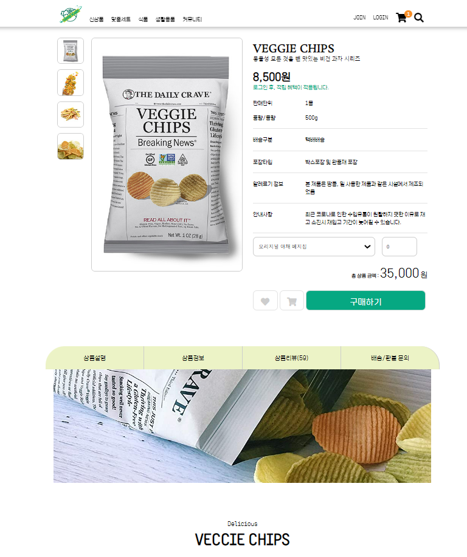
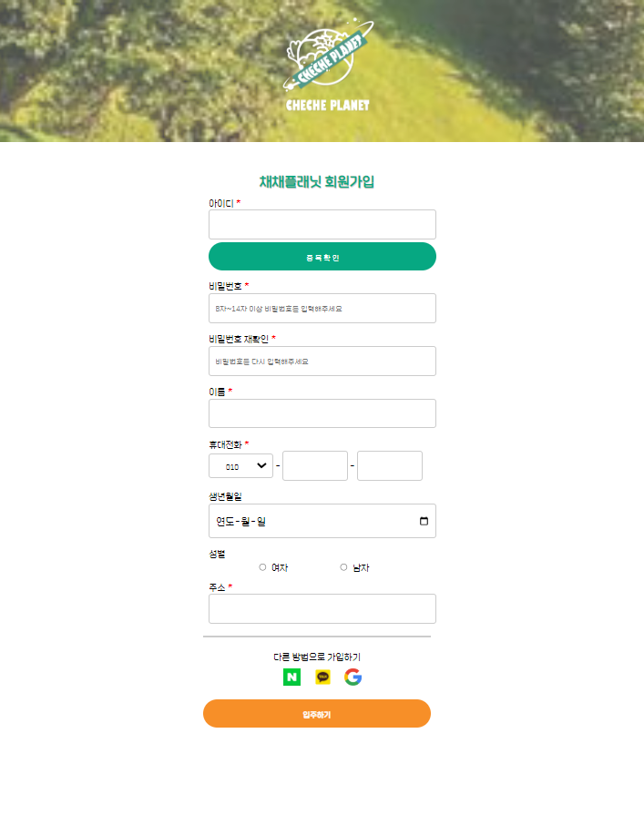
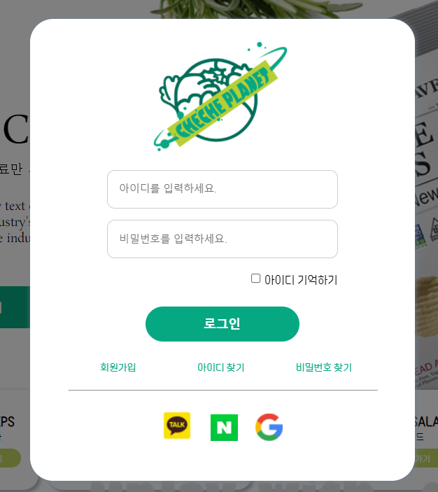

# 채채플래닛(CHECHE PLANET)
날짜: January 17, 2022 → January 26, 2022

## 기여도

1. 기획 100%, 디자인 100%, 코딩 100% 
2. 디자인 : FIGMA, PHOTOSHOP
3. 사용언어 : HTML, CSS, JQUERY, JAVASCRIPT

## 1. 웹페이지 기획서

## 2. 페이지 구성 디자인

[디자인 시안(Figma)](https://www.figma.com/embed?embed_host=notion&url=https%3A%2F%2Fwww.figma.com%2Ffile%2F9FtUP4369mC83gEWlxgonw%2F%25EC%25B1%2584%25EC%25B1%2584%25ED%2594%258C%25EB%259E%2598%25EB%258B%259B%3Fnode-id%3D0%253A1)

### 페이지 구성
> 1. index.html 
> 1-1. 로그인 모달창
> 2. 서브페이지
> 3. 회원가입 페이지

 

    
    
    
    

 

## 3. 페이지 상세 설명

### 1.메인페이지 : **디자인 4일 + 코딩 6일**

목표 : 내가 직접 한 디자인을 코드로 작성해 구현을 목표로 한다.

---

- HTML, CSS에 대한 이해도를 높이고, 웹페이지 구현에 있어 효율적으로 구현 할 수있도록 노력하였다.
- 베스트 상품 섹션의 동적 요소는 ‘[오픈소스(AOS)](https://github.com/michalsnik/aos.git)’를 사용하였다.
- login 버튼 클릭시 로그인 모달창이 나오도록 구현하였다.
- [지구를 위한 작은 행동]의 슬라이더는 ‘자바스크립트’를 이용하여 자동으로 무한히 움직이도록 구현하였다.

### 2.서브페이지 : **디자인 2일 + 코딩 3일**

목표 : 상세페이지는 코딩으로 구현한다.

---

- 자바스크립트를 이용해 최상단 옵션의 작은 이미지를 클릭했을 때, 큰 화면의 이미지에 나타나도록 구현하였다.
- 리뷰 섹션에 클릭했을때 리뷰를 자세히 볼 수 있도록 제이쿼리를 이용하여 구현하였다.
클릭을 하면 리뷰의 가려진 부분을 볼 수 있게 하였다.
- 상세페이지를 마크업을 통해 구현하도록 노력하였다.

## 4. 프로젝트를 마치며

디자인과 함께 마크업을 온전히 나의 힘으로 해야 했던 프로젝트였다. 디잔인부터 쉽지 않았다. 사이트에 필요한 이미지를 찾고 편집하는 일이 사이트 디자인을 하는 것보다 더 많은 시간이 걸렸다.
html, css에서는 어떻게 하면 경제적으로 코드를 작성할 것 인가에 대해 고민을 했지만 막상 프로젝트를 진행하려고 하니 생각보다 쉽지 않은 일이었다. 나만의 기준으로 정리된 규칙을 만들어겟다는
생각이 드는 프로젝트 였다. 

메인페이지의 배너 안에  작은 슬라이드는 클릭을 했을때 큰 배너의 이미지가 해당 클릭했을때의 콘텐츠로 돌아가겟금 만들고 싶었는데 하지 못한 상태이다. 자바스크립를 조금 더 공부해서 이 점을 
보완해 처음 기획 했던 의도 대로 만들 것이다.
